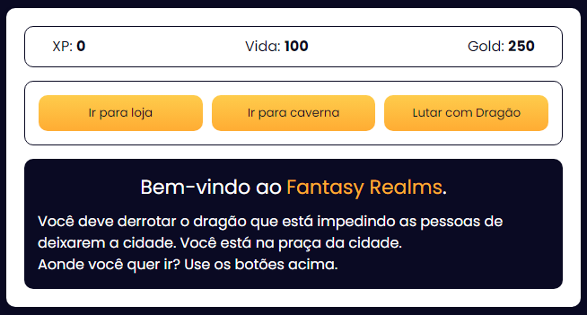
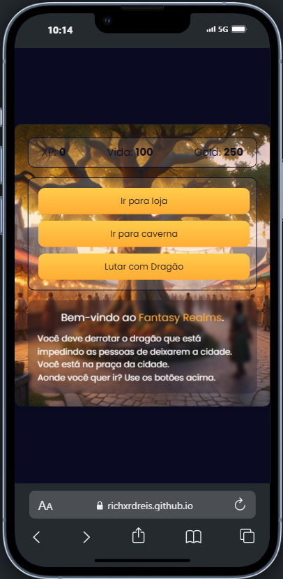

# Fantasy Realms

🎮 **Fantasy Realms** é um jogo RPG interativo desenvolvido com HTML, CSS e JavaScript. Enfrente monstros, adquira itens e viva uma aventura épica para salvar a cidade do temível Dragão!

## 📸 Capturas de Tela

### Versão para PC/Mobile

  
  

## 🚀 Visão Geral

Em **Fantasy Realms**, você embarca em uma jornada para derrotar monstros e, finalmente, enfrentar o Dragão. No caminho, você poderá:

- Comprar itens valiosos
- Lutrar contra monstros de diferentes dificuldades
- Acumular experiência e ouro
- Explorar várias localidades com interações únicas
- Descobrir easter eggs escondidos

## ⚔️ Recursos do Jogo

- Sistema de combate com diferentes armas
- Monstros variados com níveis de dificuldade
- Opções de compra de itens para melhorar suas chances de vitória
- Diversas localidades com interações próprias
- Easter eggs para jogadores curiosos

## 🤝 Contribuições

Sinta-se à vontade para contribuir com melhorias e sugestões! Caso encontre algum bug ou tenha uma ideia para uma nova funcionalidade, abra uma issue ou envie um pull request.

---

Obrigado por experimentar **Fantasy Realms**! Seu feedback é muito apreciado. Divirta-se jogando e compartilhe suas experiências!
